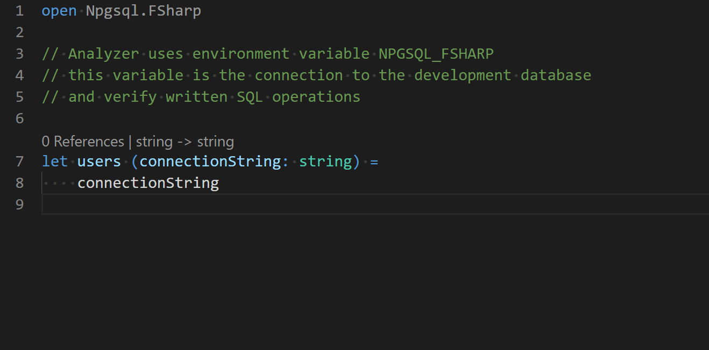

# Npgsql.FSharp.Analyzer

Analyzer that provides embedded **SQL syntax analysis** when writing queries using [Npgsql.FSharp](https://github.com/Zaid-Ajaj/Npgsql.FSharp). It verifies query syntax, checks the parameters in the query match with the provided parameters and performs **type-checking** on the functions that read columns from the result sets.



## Features
- Static query syntax analysis and type-checking against development database
- Detecting missing or redundant parameters
- Detecting parameters with type-mismatch
- Verifying the columns being read from the result set and their types
- Detecting nullable columns
- Built-in code fixes and nice error messages
- Ability to write multi-line queries in `[<Literal>]` text and referencing it
- Ability to suppress the warnings when you know better than the analyzer ;) 
- Free (MIT licensed)
- Supports VS Code with [Ionide](https://github.com/ionide/ionide-vscode-fsharp) via F# Analyzers SDK
- Supports Visual Studio
- Supports CLI (via Ubik)

## NuGet

| Package              | Stable                                                                                                                     | Prerelease                                                                                                                                         |
| -------------------- | -------------------------------------------------------------------------------------------------------------------------- | -------------------------------------------------------------------------------------------------------------------------------------------------- |
| NpgsqlFSharpAnalyzer | [](https://www.nuget.org/packages/NpgsqlFSharpAnalyzer/) | [](https://www.nuget.org/packages/NpgsqlFSharpAnalyzer/) |
| Ubik | [](https://www.nuget.org/packages/Ubik/) | [](https://www.nuget.org/packages/Ubik/) |

## Using The Analyzer (Visual Studio) 

### 1 - Configure the connection string to your development database
The analyzer requires a connection string that points to the database you are developing against. You can configure this connection string by either creating a file called `NPGSQL_FSHARP` (without extension) somewhere next to your F# project or preferably in the root of your workspace. This file should contain that connection string and nothing else. An example of the contents of such file:
```
Host=localhost; Username=postgres; Password=postgres; Database=databaseName
```
> Remember to add an entry in your .gitingore file to make sure you don't commit the connection string to your source version control system.

Another way to configure the connection string is by setting the value of an environment variable named `NPGSQL_FSHARP` that contains the connection string.

The analyzer will try to locate and read the file first, then falls back to using the environment variable.

### 2 - Install the Visual Studio Extension

Download the latest version of `NpgsqlFSharpVs.vsix` from the [Releases](https://github.com/Zaid-Ajaj/Npgsql.FSharp.Analyzer/releases) page and double click the extension to install in on your system.

## Using The Analyzer (VS Code)

### 1 - Configure the connection string to your development database
The analyzer requires a connection string that points to the database you are developing against. You can configure this connection string by either creating a file called `NPGSQL_FSHARP` (without extension) somewhere next to your F# project or preferably in the root of your workspace. This file should contain that connection string and nothing else. An example of the contents of such file:
```
Host=localhost; Username=postgres; Password=postgres; Database=databaseName
```
> Remember to add an entry in your .gitingore file to make sure you don't commit the connection string to your source version control system.

Another way to configure the connection string is by setting the value of an environment variable named `NPGSQL_FSHARP` that contains the connection string.

The analyzer will try to locate and read the file first, then falls back to using the environment variable.

### 2 - Install the analyzer using

#### a. paket
Use paket to install the analyzer into a specialized `Analyzers` dependency group like this:
```
paket add NpgsqlFSharpAnalyzer --group Analyzers
```
**DO NOT** use `storage:none` because we want the analyzer package to be downloaded physically into `packages/analyzers` directory.

#### b. nuget
```
nuget install NpgsqlFSharpAnalyzer -OutputDirectory packages/analyzers
```

### 3 - Enable analyzers in Ionide
Make sure you have these settings in Ionide for FSharp
```json
{
    "FSharp.enableAnalyzers": true,
    "FSharp.analyzersPath": [
        "./packages/analyzers"
    ]
}
```
Which instructs Ionide to load the analyzers from the directory of the analyzers into which `NpgsqlFSharpAnalyzer` was installed.

# Using CLI with Ubik

### 1 - Configure the connection string to your development database
The analyzer requires a connection string that points to the database you are developing against. You can configure this connection string by either creating a file called `NPGSQL_FSHARP` (without extension) somewhere next to your F# project or preferably in the root of your workspace. This file should contain that connection string and nothing else. An example of the contents of such file:
```
Host=localhost; Username=postgres; Password=postgres; Database=databaseName
```
> Remember to add an entry in your .gitingore file to make sure you don't commit the connection string to your source version control system.

Another way to configure the connection string is by setting the value of an environment variable named `NPGSQL_FSHARP` that contains the connection string.

The analyzer will try to locate and read the file first, then falls back to using the environment variable.

### 2 - Install Ubik as a dotnet CLI tool
```
dotnet tool install ubik --global
```
### 3 - Run Ubik in the directory of the project you want to analyze
```bash
cd ./path/to/project
ubik

ubik ./path/to/Project.fsproj

ubik ./File1.fs ./AnotherFile.fs

ubik --version
```

### Writing Long Multi-line Queries

When it is not convenient to write a query inline like this:
```fs
Sql.query "HERE COMES A VERY LONG QUERY"
```
You can define the query as a *module-level* `[<Literal>]` string and use it from the `Sql.query` function like this:
```fs
let [<Literal>] selectActiveUsers = """
    SELECT * FROM users
    WHERE is_active = @is_active
"""

let activeUsers (connectionString: string) =
    connectionString
    |> Sql.connect
    |> Sql.query selectActiveUsers
    |> Sql.parameters [ "is_active", Sql.bit true ]
    |> Sql.execute (fun read -> read.text "username")
```
The `[<Literal>]` string has to be defined in the same module in order for the analysis to run properly.

Better yet, if you use the [FSharp.Data.LiteralProviders](https://github.com/Tarmil/FSharp.Data.LiteralProviders) package, you can write your SQL queries in external SQL files and load them in compile-time as a `[<Literal>]` string to allow for the analyzer to pick it up:
```fs
let [<Literal>] selectActiveUsers = TextFile<"selectActiveUsers.sql">.Text

let activeUsers (connectionString: string) =
    connectionString
    |> Sql.connect
    |> Sql.query selectActiveUsers
    |> Sql.parameters [ "is_active", Sql.bit true ]
    |> Sql.execute (fun read -> read.text "username")
```
Just remember that these `[<Literal>]` strings have to defined in the same module where the query is written.

### Suppressing the generated warning messages

Use the `Sql.skipAnalysis` function from main library to tell the analyzer to skip the analysis of a code block like this one:
```fs
open Npgsql.FSharp

let badQuery connection =
    connection
    |> Sql.query "SELECT * FROM non_existing_table"
    |> Sql.skipAnalysis
    |> Sql.execute (fun read -> read.int64 "user_id") 
```

### Developing

Make sure the following **requirements** are installed on your system:

- [dotnet SDK](https://www.microsoft.com/net/download/core) 3.0 or higher
- Postgres database server

### Building


```sh
> build.cmd <optional buildtarget> // on windows
$ ./build.sh  <optional buildtarget>// on unix
```

### Running The Tests

The tests create and dispose a test database dynamically so you don't need to setup anything. This database is created using a default connection string that connects to your local Postgres server like this:
```fs
let createTestDatabase() =
    Sql.host "localhost"
    |> Sql.port 5432
    |> Sql.username "postgres"
    |> Sql.password "postgres"
    |> Sql.formatConnectionString
    |> ThrowawayDatabase.Create
```
Make sure you have a user with username and password called `postgres`.  An easy way to do this is to run the dockerized instance of postgres set up in the `docker-compose.yml` file in the root of this repository:

```shell
repo root> docker-compose up -d
```

This will spawn a PostgresQL 12 database with the expected username and password, bound to the default port 5432. When you are done testing, this database can be destroyed like so:

```shell
repo root> docker-compose down
```

---

### Build Targets

- `Clean` - Cleans artifact and temp directories.
- `DotnetRestore` - Runs [dotnet restore](https://docs.microsoft.com/en-us/dotnet/core/tools/dotnet-restore?tabs=netcore2x) on the [solution file](https://docs.microsoft.com/en-us/visualstudio/extensibility/internals/solution-dot-sln-file?view=vs-2019).
- [`DotnetBuild`](#Building) - Runs [dotnet build](https://docs.microsoft.com/en-us/dotnet/core/tools/dotnet-build?tabs=netcore2x) on the [solution file](https://docs.microsoft.com/en-us/visualstudio/extensibility/internals/solution-dot-sln-file?view=vs-2019).
- `DotnetTest` - Runs [dotnet test](https://docs.microsoft.com/en-us/dotnet/core/tools/dotnet-test?tabs=netcore21) on the [solution file](https://docs.microsoft.com/en-us/visualstudio/extensibility/internals/solution-dot-sln-file?view=vs-2019).
- `GenerateCoverageReport` - Code coverage is run during `DotnetTest` and this generates a report via [ReportGenerator](https://github.com/danielpalme/ReportGenerator).
- `WatchTests` - Runs [dotnet watch](https://docs.microsoft.com/en-us/aspnet/core/tutorials/dotnet-watch?view=aspnetcore-3.0) with the test projects. Useful for rapid feedback loops.
- `GenerateAssemblyInfo` - Generates [AssemblyInfo](https://docs.microsoft.com/en-us/dotnet/api/microsoft.visualbasic.applicationservices.assemblyinfo?view=netframework-4.8) for libraries.
- `DotnetPack` - Runs [dotnet pack](https://docs.microsoft.com/en-us/dotnet/core/tools/dotnet-pack). This includes running [Source Link](https://github.com/dotnet/sourcelink).
- `PublishToNuGet` - Publishes the NuGet packages generated in `DotnetPack` to NuGet via [paket push](https://fsprojects.github.io/Paket/paket-push.html).
- `BuildDocs` - Generates Documentation from `docsSrc` and the [XML Documentation Comments](https://docs.microsoft.com/en-us/dotnet/csharp/programming-guide/xmldoc/) from your libraries in `src`.
- `WatchDocs` - Generates documentation and starts a webserver locally.  It will rebuild and hot reload if it detects any changes made to `docsSrc` files, libraries in `src`, or the `docsTool` itself.
- `ReleaseDocs` - Will stage, commit, and push docs generated in the `BuildDocs` target.
---
